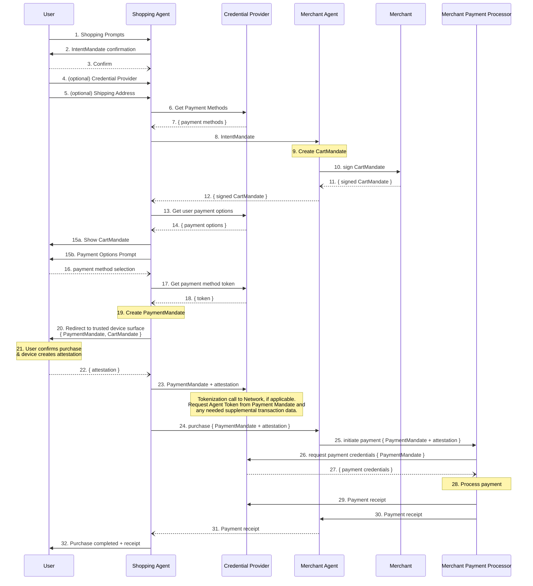

Google just dropped AP2 ([Agent Payment Protocol][1]) with backing from over 60 organizations including American Express, Mastercard, PayPal, Coinbase, and Salesforce. It's technically impressive—cryptographic mandates, verifiable credentials, complete audit trails. The protocol tackles a genuine problem: **how do AI agents pay for things when we're not around?** But after digging through the specs and watching teams struggle with basic MCP implementations, I can't shake this feeling that we're over-engineering for a future that hasn't arrived.

Let me walk you through what AP2 actually does, then we'll talk about why it might be solving tomorrow's problems with a little extra complexity.

## The Problem We're Solving (Eventually)

Imagine your AI assistant booking a flight while you're asleep. Sounds simple enough—until you realize the cascade of trust issues this creates. Who authorized this purchase? How does the airline know this agent represents you? What happens when something goes wrong and you need to dispute the charge?

AP2 ([core principles here][2]) is built on four core principles that sound great on paper:
- **Openness and Interoperability** promises a protocol that works across all payment ecosystems. Ambitious, considering we can't even get payment systems to play nice with each other today.
- **User Control and Privacy** keeps you in charge with role-based architecture. Your payment details stay protected while agents negotiate on your behalf.
- **Verifiable Intent** means no more "I didn't mean to buy that" scenarios. Every transaction requires cryptographic proof of what you actually wanted.
- **Transaction Accountability** creates non-repudiable audit trails. When your agent inevitably does something unexpected, at least you'll have forensic-level documentation of exactly how it happened.

## How AP2 Actually Works

The protocol extends A2A ([Agent-to-Agent communication][3]) with a payments layer. It sits at the top of a three-layer cake:

```
┌─────────────────────────────────┐
│  AP2: Payment Communications    │ ← "Agents communicate about payments"
├─────────────────────────────────┤
│  A2A: Agent-to-Agent Protocol   │ ← "Agents communicate with other agents"
├─────────────────────────────────┤
│  MCP: Model Context Protocol    │ ← "Agents communicate with data/APIs"
└─────────────────────────────────┘
```

Each layer has its purpose. MCP lets agents talk to tools. A2A lets them talk to each other. AP2 lets them talk about money. Simple in theory, complex in practice.

The magic happens through three types of Verifiable Credentials (VCs)—cryptographically signed documents that would make a notary jealous:

### Intent Mandates: Your Agent's Shopping List

When you tell your agent "book me a flight to NYC under $500," that instruction becomes an Intent Mandate—a cryptographically signed document that says exactly what your agent can and cannot buy. It's like giving your teenager a credit card with very specific rules about what they can purchase. Except this teenager can't sweet-talk their way around the restrictions.

### Cart Mandates: The "Are You Sure?" Moment

Before any money changes hands, the merchant's agent generates a Cart Mandate—basically a detailed preview of what's about to happen. This prevents your agent from "creatively interpreting" your instructions. You wanted one flight ticket, not a round-the-world cruise that technically stops in NYC.

### Payment Mandates: The Paper Trail

The final piece provides actual payment authorization and creates an audit trail that would make an accountant weep with joy. Every party—you, your agent, the merchant, the payment processor—gets cryptographic proof of exactly what transpired. When disputes arise (and let's be honest, they will), everyone has receipts.

## The Cast of Characters

AP2 requires four players to tango:

The **User** (that's you) kicks things off with a task and the financial authority to complete it. Your **Shopping Agent** acts as your digital representative, coordinating the purchase and keeping you in the loop. The **Credential Provider** manages the cryptographic heavy lifting—think of them as the notary public of the digital world. And the **Merchant Agent** represents the seller, negotiating the nitty-gritty details of what you're actually buying.

Who will be the Credential Providers? Payment processors like Stripe or PayPal seem like natural fits, since they handle checkouts already, but are they not sub-processors of the **Shopping Agent**? The ecosystem is wide open, which is both exciting and a bit underrepresented.


## Workflow: The 32-Step Dance

Here's where AP2's complexity becomes daunting. What the documentation calls an "illustrative transaction flow" ([full specs here][4]) actually involves **32 distinct steps** for a single purchase. Let me walk you through the highlights:

*The AP2 specification includes a detailed sequence diagram at [Section 7.1](https://ap2-protocol.org/specification/#71-illustrative-transaction-flow) showing the complete 32-step transaction flow:*



## Breaking Down the 32 Steps

### Phase 1: Intent Formation (Steps 1-7)
**Purpose**: Establish user intent and payment discovery

1. **Shopping Prompts** → User provides shopping request to Shopping Agent
2. **IntentMandate Confirmation** → Shopping Agent presents intent for user confirmation
3. **User Confirms** → User approves the IntentMandate
4. **(Optional) Credential Provider** → User may specify preferred credential provider
5. **(Optional) Shipping Address** → User provides shipping info to ensure final pricing
6. **Get Payment Methods** → Shopping Agent queries available payment options from Credential Provider
7. **Payment Methods Returned** → Credential Provider responds with available payment methods

### Phase 2: Cart Building & Merchant Validation (Steps 8-12)
**Purpose**: Create and validate the shopping cart with merchant

8. **IntentMandate to Merchant** → Shopping Agent sends intent to Merchant Agent
9. **Create CartMandate** → Merchant Agent builds cart based on intent
10. **Sign CartMandate** → Merchant entity (not agent) signs to guarantee fulfillment at specified price
11. **Signed CartMandate Returned** → Merchant sends signed cart back to Merchant Agent
12. **CartMandate to Shopping Agent** → Merchant Agent forwards signed cart to Shopping Agent

### Phase 3: Payment Options & User Review (Steps 13-16)
**Purpose**: Present cart and payment options for user selection

13. **Get User Payment Options** → Shopping Agent requests user-specific payment options
14. **Payment Options Returned** → Credential Provider returns available payment methods
15. **Show Cart & Payment Options** → Shopping Agent presents:
    - 15a: CartMandate details
    - 15b: Payment options prompt
16. **Payment Method Selection** → User selects preferred payment method

### Phase 4: Payment Mandate Creation (Steps 17-23)
**Purpose**: Create and attest payment authorization

17. **Get Payment Method Token** → Shopping Agent requests token from Credential Provider
18. **Token Returned** → Credential Provider provides payment token
19. **Create PaymentMandate** → Shopping Agent generates payment authorization
20. **Redirect to Trusted Surface** → User sent to secure environment with PaymentMandate & CartMandate
21. **User Confirms & Attestation** → User confirms purchase; device creates cryptographic attestation
22. **Attestation Returned** → Signed attestation sent to Shopping Agent
23. **PaymentMandate + Attestation** → Shopping Agent sends both to Credential Provider for validation

### Phase 5: Payment Processing (Steps 24-27)
**Purpose**: Execute payment through merchant's processor

24. **Purchase Request** → Shopping Agent sends PaymentMandate + attestation to Merchant Agent
25. **Initiate Payment** → Merchant Agent forwards to Merchant Payment Processor
26. **Request Payment Credentials** → Payment Processor requests credentials from Credential Provider
27. **Payment Credentials Returned** → Credential Provider provides payment credentials

### Phase 6: Settlement & Receipt Distribution (Steps 28-32)
**Purpose**: Process payment and distribute receipts

28. **Process Payment** → Merchant Payment Processor executes transaction
29. **Receipt to Credential Provider** → Payment receipt sent for records
30. **Receipt to Merchant Agent** → Payment confirmation sent to merchant
31. **Receipt to Shopping Agent** → Transaction confirmation forwarded
32. **Purchase Complete** → User receives final receipt and confirmation

## Key Implementation Details

### Critical Design Decisions

- **Step 5**: Shipping address must be provided before cart creation to ensure final pricing accuracy. All selections affecting price must be completed before CartMandate creation.

- **Step 10**: The merchant entity (not the agent) signs the CartMandate, creating a binding commitment to fulfill the order at the specified SKU, price, and shipping terms.

- **Step 15**: This is the **load-bearing step** where the user verifies all transaction details before proceeding. This represents the critical trust moment in the entire flow.

- **Step 20-21**: The "trusted device surface" redirect ensures payment confirmation happens in a secure environment, with device-level attestation providing cryptographic proof of user intent.

- **PaymentMandate vs CartMandate**: These serve distinct purposes:
  - **CartMandate**: Contains all information the merchant needs to fulfill the order
  - **PaymentMandate**: Provides payment authorization with AI agent involvement indicators (Human Present vs Human Not Present)

### Network Integration

Though not shown in the diagram, Step 28 includes the Payment Service Provider sending transaction authorization (with PaymentMandate) to supporting networks and issuers. This allows these parties to:
- Recognize AI agent involvement in the transaction
- Apply appropriate risk assessment rules
- Make informed approve/deny/challenge decisions based on the transaction modality

### The Main Acts:

**Act 1: Intent Formation (Steps 1-6)**
You tell your agent what you want. It negotiates with the Credential Provider to create an Intent Mandate. Payment methods are discovered. Six steps before you've even found a merchant.

**Act 2: Cart Negotiation (Steps 7-16)**
Your agent finds merchants, negotiates products, creates and signs Cart Mandates. The merchant signs their part. Your agent validates everything. Ten more steps just to build a shopping cart.

**Act 3: Payment Authorization (Steps 17-27)**
You select a payment method. A Payment Mandate gets created. You're redirected to a "trusted device surface" (because apparently your current device isn't trusted enough). Attestations are generated. Tokens are created. Eleven steps for what credit cards do in one swipe.

**Act 4: Transaction Execution (Steps 28-32)**
Finally, actual payment processing happens. The network authorizes, receipts are generated, and everyone gets their cryptographically signed proof of what just happened.

32 steps. Each with potential failure points. Each requiring all parties to speak AP2 fluently. It's like requiring a UN summit to buy a latte.

## What AP2 Promises (On Paper)

### Transaction Types That (Theoretically) Work

The protocol promises to handle an ambitious range of scenarios:

**Human-Present Transactions**: You watch your agent shop in real-time, approving each step. Useful for high-value purchases where you want oversight.

**Human-Not-Present Transactions**: The holy grail—your agent handles everything while you sleep. Wake up to find your flight booked, hotel reserved, and rental car waiting. Or wake up to find your agent misunderstood "book a flight to Newark" as "book every flight to Newark."

**B2B Autonomous Procurement**: Enterprise agents negotiating contracts, managing supply chains, and handling recurring orders. Because what could possibly go wrong with AI agents committing to million-dollar purchase orders?

**Dynamic Pricing Negotiations**: Your agent haggling with a merchant's agent over cloud compute prices. Two AIs arguing about money—it's like watching robots play poker.

### Security That Would Make a Bank Jealous

Every mandate gets cryptographically signed. Every transaction creates non-repudiable records. You get granular control over what your agent can buy, where, and for how much. The audit trail is so complete that forensic accountants might actually enjoy reading it.

### Payment Flexibility

AP2 plays nice with traditional payment cards, bank transfers, and even cryptocurrencies (through the A2A x402 extension). Platform-specific payment methods? Also supported. They've thought of everything—which might be part of the problem.

## How Payments Actually Work Today on MCP/A2A

Before diving into what AP2 promises, let's talk about how teams are actually handling payments and value exchange in the MCP/A2A ecosystem right now. Spoiler: it's a patchwork of workarounds that keep authentication on-protocol and payments decidedly off-protocol.

### The OAuth Dance: "Just Use Your Regular Account"

The most common approach? Standard SaaS subscriptions with OAuth bridges to MCP. You pay Anthropic or OpenAI or whoever your regular monthly fee, then OAuth that account into your MCP server. Your agent gets access to the service through your authenticated account. Simple, boring, works.

This is how most consumer-facing AI services operate today. You're not really paying through MCP—you're paying the old-fashioned way and then letting MCP borrow your credentials. It's like giving your teenager your Netflix password instead of teaching them how to pay bills.

### B2B Contracts and Secret Handshakes

For enterprise deployments, it's even more old-school. Companies negotiate traditional contracts, sign PDFs (probably via DocuSign), and then provision API keys or secret tokens for their agents to use. The payment happens through accounts receivable, ACH transfers, or wire transfers—the same way enterprises have been paying for software since the dawn of SaaS.

The "agent" part is just another API consumer with a fancy name. Authentication happens through privately provisioned keys that get rotated quarterly (if you're lucky) or never (if you're realistic).

### Pay-Per-Use with Pre-Paid Credits

Some services have gotten slightly more sophisticated with token-based systems. You pre-purchase credits (image generation tokens, API calls, compute hours), and your agent draws down from that balance. Think of it like a toll road E-ZPass for APIs.

This works reasonably well for metered services but requires you to:
1. Pre-fund your account (no pay-as-you-go)
2. Monitor credit balances (or risk service interruption)
3. Top up manually when running low (automation? what automation?)

Services like Midjourney, various LLM providers, and cloud compute platforms use this model. Your agent authenticates with MCP/A2A protocols, but the actual value exchange happened when you entered your credit card on their website last month.

### The Current Reality: Authentication ≠ Payment

Here's the key insight: **Authentication lives on MCP/A2A, but payment lives everywhere else.**

The protocols handle identity, permissions, and API access beautifully. But when it comes to actually exchanging value? We're using the same payment rails we've used for the last decade. Credit cards entered into web forms. Wire transfers initiated by humans. Purchase orders approved in Salesforce.

This disconnect creates real friction:
- **No Dynamic Pricing**: Your agent can't negotiate rates because payment terms were fixed in a contract six months ago
- **No Micro-Transactions**: Everything needs to be batched into monthly bills or pre-paid in chunks
- **No Agent-to-Agent Commerce**: Agents can share data but can't actually transact with each other
- **Manual Reconciliation**: Finance teams still manually matching invoices to usage reports

### Why This Matters for AP2

This context is crucial for understanding both why AP2 exists and why adoption will be challenging. We're not replacing nothing—we're replacing a bunch of "good enough" workarounds that people have already built and gotten comfortable with.

The bar isn't "better than nothing." It's "better than OAuth + Stripe." That's a much higher bar.

## Reality Check: Where We Actually Are

### What's Real

We have a published specification (v1.0), the A2A x402 extension for crypto payments, and a GitHub repository with documentation. There's an industry working group with 60+ big names, which suggests serious intent.

### What's Missing (Spoiler: Everything That Matters)

No reference implementations. Zero production deployments. No SDK libraries to speak of. The dispute resolution mechanism? Still being figured out. Trust establishment beyond basic allow-lists? Not there yet.

But wait, there's more missing:

**Regulatory Framework**: Financial regulators haven't even started thinking about AI agents making autonomous payments. KYC for bots? AML for algorithms? Nobody knows.

**Error Recovery**: What happens when step 17 of 32 fails? Start over? Partial rollback? The spec is mysteriously quiet on this.

**Performance Metrics**: How long do these 32 steps take? What's the latency? What's the success rate? No data exists because nobody's actually running this in production.

**Backwards Compatibility**: How does AP2 work with the 99.9% of payment systems that don't speak AP2? Spoiler: it doesn't.

Let that sink in. We have a protocol for agent payments, but no actual agents using it in production. It's like publishing a manual for flying cars while we're still trying to make self-driving cars not crash into fire trucks.

### The Adoption Mountain

Getting AP2 off the ground requires all four parties—users, agents, credential providers, and merchants—to adopt simultaneously. Each needs cryptographic infrastructure. Everything must integrate with existing payment rails. Oh, and it all needs to comply with financial regulations that weren't written with AI agents in mind.

It's like trying to launch a four-sided marketplace where everyone needs to show up at once, speak a new language, and trust a system that's never been battle-tested.

## What You Should Actually Do About This

### If You're Building Agents

Here's my advice: start simple. Most of your use cases can probably be handled with offline credential configuration—the boring MCP approach where you set up payment access once and forget about it. Design your permission systems with AP2's mandate concepts in mind, but don't implement the full protocol yet. Build robust audit trails now (you'll need them anyway), and keep an eye on the ecosystem. When reference implementations appear and early adopters share war stories, you'll know it's time to jump in.

### If You're a Payment Provider

Don't ignore AP2, but don't bet the farm on it either. Assess what it would take to support the protocol—the answer might surprise you (and not in a good way). Plan for a hybrid world where traditional and AP2 transactions coexist for years. Start thinking about compliance now, because regulators move slowly and AI agents aren't on their radar yet.

## The Verdict: Right Problem, Wrong Timing?

Let's be clear: we absolutely need something like AP2. The vision of agents handling complex transactions autonomously isn't science fiction—it's coming. Google and friends are right to tackle authorization, authenticity, and accountability. The protocol is technically sound, well-thought-out, and addresses real problems we'll eventually face.

But here's where I get skeptical.

We're proposing a seven-step cryptographic dance for transactions when most teams can't get basic MCP servers running reliably. We're solving for agent-to-agent payment negotiations when most "agents" today are glorified API wrappers with RAG attached. We're building infrastructure for an economy that doesn't exist yet.

The industry backing is impressive—60+ organizations don't sign onto protocols for fun. The extensible design means it can evolve with needs. The audit trail capabilities will make compliance teams happy (eventually).

Yet without reference implementations, without production deployments, without even basic SDK libraries, AP2 feels like we're designing a highway system for flying cars while most of us are still figuring out how to parallel park.

## Where This Leaves Us

My take? AP2 is probably the right answer, just 2-3 years too early. The protocol is solving for a world where:
- Agents are sophisticated enough to handle 32-step payment flows
- Merchants have agent-compatible infrastructure
- Credential providers exist and are trusted
- Regulators have blessed AI-initiated transactions
- Users trust their agents with real money

We're in maybe... one of those five? Being generous?

Most current use cases can be handled with simpler approaches—offline credentials, API keys, traditional payment integrations. The subset of problems that genuinely need AP2's full capabilities is vanishingly small today.

Here's the reality check: if your agent can barely handle a MCP connection without timing out, it's not ready for 32-step cryptographic payment flows. If your users are still asking "what's an AI agent?", they're not ready to trust one with their credit card.

What we might need first is a stepping stone. Something simpler:

**AP2 Lite**: Just Intent Mandates. Let agents prove they have permission to act, without the full 32-step symphony.

**Sandbox First**: Give us a test environment where agents can practice spending Monopoly money before we trust them with real payments.

**Progressive Adoption**: Start with human-in-the-loop approvals for everything. Gradually increase autonomy as trust builds.

**Reference Implementation That Actually Works**: One real, working example is worth a thousand specifications.

Organizations should absolutely study AP2 to understand where we're headed. But for actual implementation? Start with the simple stuff that works today. When you see reference implementations in the wild, when early adopters start sharing success stories (and horror stories), when your use cases genuinely demand autonomous agent payments—that's when you make the jump.

Until then, AP2 remains what it is: a technically impressive solution waiting for its problem to catch up.

---


<CardGroup cols={2}>
  <Card title="Share on LinkedIn" href="https://www.linkedin.com/sharing/share-offsite/?url=https://blog.elevate.do/a2a/agent-payment-protocol-ap2" icon="linkedin">
    Share this article with your network
  </Card>
  <Card title="Share on X" href="https://twitter.com/intent/tweet?url=https://blog.elevate.do/a2a/agent-payment-protocol-ap2&text=Understanding Google's AP2 protocol and why it's the missing layer for agent commerce" icon="twitter">
    Tweet this article to your followers
  </Card>
  <Card title="Schedule a Chat" href="https://calendly.com/rahul-parundekar/30min" icon="calendar">
    Let's discuss agent infrastructure and autonomous systems
  </Card>
  <Card title="About Elevate.do" href="https://elevate.do" icon="building">
    Learn more about our work in AI infrastructure and workplace transformation
  </Card>
</CardGroup>

<CardGroup cols={2}>
  <Card title="Follow on LinkedIn" href="https://linkedin.com/in/rahulparundekar" icon="linkedin">
    Connect with me for more insights on AI agents and infrastructure
  </Card>
  <Card title="Follow on X" href="https://x.com/rahulparundekar" icon="twitter">
    Follow for real-time thoughts on AI agents and protocols
  </Card>
</CardGroup>

---

## References

- Google's announcement of the Agent Payment Protocol with industry support and vision ([Google Cloud Blog][1])
- Core principles behind AP2: openness, user control, verifiable intent, and accountability ([AP2 Protocol][2])
- How AP2 integrates with A2A and MCP in the agent protocol stack ([AP2 Protocol - Integration][3])
- Complete technical specification including the seven-step transaction flow ([AP2 Protocol - Specs][4])

[1]: https://cloud.google.com/blog/products/ai-machine-learning/announcing-agents-to-payments-ap2-protocol "Google Announces Agent Payment Protocol"
[2]: https://ap2-protocol.org/#core-principles-and-goals "AP2 Core Principles"
[3]: https://ap2-protocol.org/topics/ap2-a2a-and-mcp/ "AP2, A2A and MCP Integration"
[4]: https://ap2-protocol.org/specification/#71-illustrative-transaction-flow "AP2 Technical Specification"
